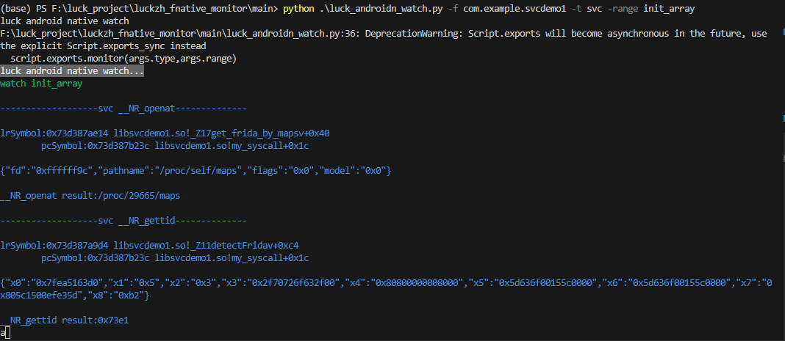
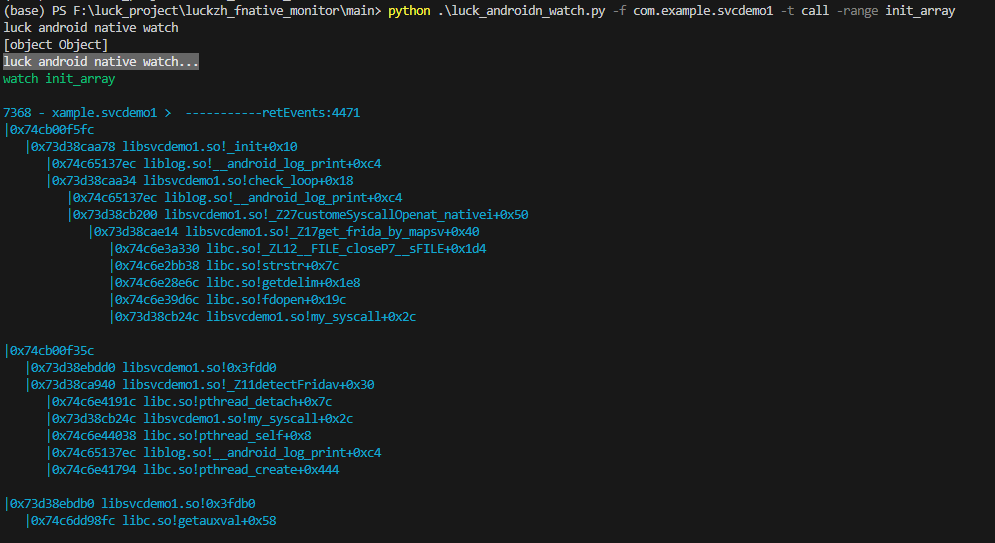
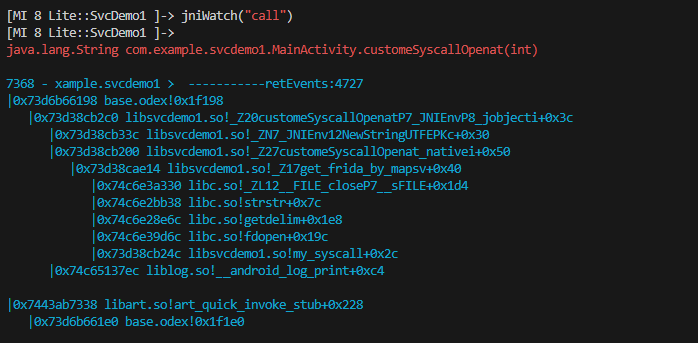

# luckzh_fnative_monitor

写这个项目 本意是想 监控native 下的 svc 调用来协助我分析 anti_frida。
但发现写完并不好用
看来还是多学学 elf结构 和 so修复 才管用。

所以这个项目 由于逆向经验少,和技术 代码质量问题,我并不能完全写完。

**但是弃之可惜,所以我发在github上让各位和我一样的萌新可以学习下,如果是大佬希望可以协助完善下**

不过目前来说功能还是可以用的,各位可以尝试用用看

个人测试 android 10. 理论上 android9~ 以上都行。
现在只支持 **arm64**

当然我觉得肯定大家会遇到问题,因为我很穷 只有一台手机可以测,其他不敢保证

## 使用方法
观察我只观察重要区域,默认全部都是 **"user"** 范围 也就是 
```
//只观察 应用目录 
//系统目录不观察 避免观察数据太多
user = /data/app/**
```

### python
对于 **python** 仅支持 **spawn** 启动
``` cmd
//进入到 main 目录
cd main

//默认观察方法调用 范围路径是 so 中的 init_array。 
python luck_androidn_watch.py -f packname

//当然您也可以更详细一点
// -t 观察类型  svc 调用 还是 普通方法调用
// -range 观察范围 jni init_array pthread_create
python luck_androidn_watch.py -f packname [-t (svc|call)] [-range ("jni"|"init_array"|"pthread_create")]
```
下面是一些浏览图
当然这是我自己写的**demo** ,所以肯定没有说服力



### frida js
如果您想附加使用,那么直接用 
```
cd agent
frida -U -l _agent.js  [应用名称]

然后再控制台输入下面任意一项
jniWatch("svc")
jniWatch("call")

pthreadCreateWatch("svc")
pthreadCreateWatch("call")
```



## 观察范围原理

目前观察范围有 3个 

### jni 观察
  
关于 jni 观察实际原理我不确定是否都通用
目前我所搜索的资料和测试效果来说,所有的 android 方法都走 **libart.so** 中的 **ArtMethod::Invoke**

``` cpp
void ArtMethod::Invoke(Thread* self, uint32_t* args, uint32_t args_size, JValue* result,
                       const char* shorty) {
                       
   if (UNLIKELY(!runtime->IsStarted() ||
               (self->IsForceInterpreter() && !IsNative() && !IsProxyMethod() && IsInvokable()))) {
                //... 非静态方法
     }else{
        //如果 native 是非静态调用 art_quick_invoke_stub
      if (!IsStatic()) {
        (*art_quick_invoke_stub)(this, args, args_size, self, result, shorty);
      } else {
        // 静态方法调用 art_quick_invoke_static_stub
        (*art_quick_invoke_static_stub)(this, args, args_size, self, result, shorty);
      }

     }                                 
}
```
虽然通过 **art_quick_invoke_stub** 和 **art_quick_invoke_static_stub**
能够监控到 **native** 方法调用,但是我发现了两个问题。

1. 部分情况会对 .dex 文件 被 jit 编译成 oat 二进制文件,导致第一次观察堆栈情况不完整,但是调用第二次 又可以成功观察到 jni 调用。

下面是观察 **oat**文件的堆栈
```
|0x7443ab7338 libart.so!art_quick_invoke_stub+0x228
   |0x74386a51e0 base.odex!0x1f1e0 
```

2.  jni 的native 静态注册 和 动态注册 有些许差别
我们先从动态注册开始看。
一般使用动态注册 会使用到 **jni.h** 中的 **RegisterNatives**。
其最终会通过 **class_linker**将我们传入的 **native** 方法指针 对应上 
**artMethod**的  **data_** 属性
``` cpp
// 1.jni.h
jint        (*RegisterNatives)(JNIEnv*, jclass, const JNINativeMethod*,
                        jint);


// 2.runtime/jni/jni_internal.cc
static jint RegisterNatives(JNIEnv* env,
                              jclass java_class,
                              const JNINativeMethod* methods,
                              jint method_count) {
              .....
    for (jint i = 0; i < method_count; ++i) {
      const char* name = methods[i].name;
      const char* sig = methods[i].signature;
      //注意 native 方法指针
      const void* fnPtr = methods[i].fnPtr;

      //根据 类信息和方法签名 查找 art methodId 
      ArtMethod* m = nullptr;
      for (ObjPtr<mirror::Class> current_class = c.Get();
              current_class != nullptr;
              current_class = current_class->GetSuperClass()) {
            m = FindMethod<true>(current_class, name, sig);
      }
   
     //通过 class_linker 绑定到 art_method
    const void* final_function_ptr = class_linker->RegisterNative(soa.Self(), m, fnPtr); 
   }
   return JNI_OK;
}


//3. runtime/class_linker.cc
const void* ClassLinker::RegisterNative(
    Thread* self, ArtMethod* method, const void* native_method) {
 void* new_native_method = nullptr;
  Runtime* runtime = Runtime::Current();
  runtime->GetRuntimeCallbacks()->RegisterNativeMethod(method,
                                                       native_method,
                                                       /*out*/&new_native_method);
                                         
  if (method->IsCriticalNative()) {
      ....
    if (method->GetDeclaringClass()->IsVisiblyInitialized()) {
      //设置 artMethod的EntryPointFromJni
      method->SetEntryPointFromJni(new_native_method);
    } else {
      critical_native_code_with_clinit_check_.emplace(method, new_native_method);
    }
  } else {
    //设置 artMethod的EntryPointFromJni
    method->SetEntryPointFromJni(new_native_method);
  }
  return new_native_method;
}      
```                        
动态注册是没问题的。我们只需要监控 **ArtMethod**方法中的**_data**字段即可
麻烦的是静态注册
静态注册一般通过我们写好的方法名格式寻找,在此之前, **ArtMethod**方法中的**_data**储存的是一个寻找 **symbol**的方法。
这种我们需要看看 **art** 加载类时候的过程
``` cpp
void ClassLinker::LoadClass(Thread* self,
                            const DexFile& dex_file,
                            const dex::ClassDef& dex_class_def,
                            Handle<mirror::Class> klass) {
    size_t class_def_method_index = 0;
    uint32_t last_dex_method_index = dex::kDexNoIndex;
    size_t last_class_def_method_index = 0;
    ClassAccessor accessor(dex_file,
                         dex_class_def,
                         /* parse_hiddenapi_class_data= */ klass->IsBootStrapClassLoaded());
    ....
    //通过 类访问器 遍历 字段和方法
    accessor.VisitFieldsAndMethods([&](
        const ClassAccessor::Field& field){
          ...
        },[&](const ClassAccessor::Field& field) REQUIRES_SHARED(Locks::mutator_lock_) {
          ...
        }, [&](const ClassAccessor::Method& method) REQUIRES_SHARED(Locks::mutator_lock_) {
            //获取 artMethod
            ArtMethod* art_method = klass->GetDirectMethodUnchecked(class_def_method_index,
                      image_pointer_size_);
            // 从 dex_file 中读取信息 加载到 artMethod          
            LoadMethod(dex_file, method, klass.Get(), art_method);  
            // 链接执行代码
            LinkCode(this, art_method, oat_class_ptr, class_def_method_index); 

            ....   
        });

        ...

 }           

 static void LinkCode(ClassLinker* class_linker,
                     ArtMethod* method,
                     const OatFile::OatClass* oat_class,
                     uint32_t class_def_method_index) REQUIRES_SHARED(Locks::mutator_lock_) {
                    ....
 if (method->IsNative()) {
    // Set up the dlsym lookup stub. Do not go through `UnregisterNative()`
    // as the extra processing for @CriticalNative is not needed yet.
    method->SetEntryPointFromJni(
        method->IsCriticalNative() ? GetJniDlsymLookupCriticalStub() : GetJniDlsymLookupStub());
  }

                     }                                        
```
对于静态注册而说,通过 **class_linker**  加载类的过程会遍历方法通过 **LinkCode**
设置 **GetJniDlsymLookupStub** 方法指针
这就通过 **ArtMethod** 的 **_data** 属性 动态监控 **jni**调用照成了阻力。
不过好在 除了第一次调用是通过  **GetJniDlsymLookupStub()**。后续又会被设置成 实际的
**jni native** 指针
``` asm
ENTRY art_jni_dlsym_lookup_stub
   ...
   //调用 artFindNativeMethodRunnable
    bl    artFindNativeMethod
    b     .Llookup_stub_continue
    .Llookup_stub_fast_or_critical_native:
    bl    artFindNativeMethodRunnable
END art_jni_dlsym_lookup_stub
```
``` cpp
extern "C" const void* artFindNativeMethodRunnable(Thread* self)
    REQUIRES_SHARED(Locks::mutator_lock_) {
      uint32_t dex_pc;
      ArtMethod* method = self->GetCurrentMethod(&dex_pc);
      ClassLinker* class_linker = Runtime::Current()->GetClassLinker();
       if (!method->IsNative()) {
          .....
       }
       //判断是不是 IsJniDlsymLookupStub 
       // 不是的话代表寻找到 jni 的 native 方法指针 
       const void* native_code = class_linker->GetRegisteredNative(self, method);
      if (native_code != nullptr) {
        return native_code;
      }
      ...
      //没有的话就根据查找 通过 class——linker 注册 native
      native_code = vm->FindCodeForNativeMethod(method, &error_msg, /*can_suspend=*/true);
      return class_linker->RegisterNative(self, method, native_code);
}      
```

### init_array
当 so 通过 linker 加载的时候,会调用初始化段的方法。
如 **.init** 和 **.init_array**
在 **bionic** 的 **linker** 中可以看到这个地方
``` cpp
//linker.cpp
void* do_dlopen(const char* name, int flags,
                const android_dlextinfo* extinfo,
                const void* caller_addr) {

       ....
      //查找 library
      soinfo* si = find_library(ns, translated_name, flags, extinfo, caller);
      loading_trace.End();

      if (si != nullptr) {
        void* handle = si->to_handle();
        //调用 .init_array
        si->call_constructors();
        failure_guard.Disable();
        LD_LOG(kLogDlopen,
              "... dlopen successful: realpath=\"%s\", soname=\"%s\", handle=%p",
              si->get_realpath(), si->get_soname(), handle);
        return handle;
      }

      return nullptr;
}           
void soinfo::call_constructors() {
  ....
 get_children().for_each([] (soinfo* si) {
    si->call_constructors();
  });

  if (!is_linker()) {
    bionic_trace_begin((std::string("calling constructors: ") + get_realpath()).c_str());
  }

  //调用 INIT 和 INIT_ARRAY
  // DT_INIT should be called before DT_INIT_ARRAY if both are present.
  call_function("DT_INIT", init_func_, get_realpath());
  call_array("DT_INIT_ARRAY", init_array_, init_array_count_, false, get_realpath());

  if (!is_linker()) {
    bionic_trace_end();
  }

}         
```

所以我们监控 **soinfo::call_constructors** 跟踪其堆栈即可。

### pthread_create
在 **bionic** 的 **libc** 中
**pthread_create** 用与创建线程
``` cpp
#include "pthread.h"
int pthread_create(pthread_t* __pthread_ptr, pthread_attr_t const* __attr, void* (*__start_routine)(void*), void*);
```
其中 ``void* (*__start_routine)(void*)`` 是线程调用的方法。
也就是说我们可以 通过拦截 **pthread_create** 获取到调用方法的指针 。完成方法的跟踪

不过也不能全部都拦截。对于 **android** 线程来说，跟踪的代码太多。所以我们得屏蔽 **art** 中的方法的

下面是 **android** 创建线程的过程
``` cpp
new Thread(run).start()

class Thread {
  public synchronized void start() {
      ...
       nativeCreate(this, stackSize, daemon);
     ...  
  }  
}

//runtime/native/java_lang_Thread.cc
static void Thread_nativeCreate(JNIEnv* env, jclass, jobject java_thread, jlong stack_size,
                                jboolean daemon) {
  // There are sections in the zygote that forbid thread creation.
  Runtime* runtime = Runtime::Current();
   ....
  Thread::CreateNativeThread(env, java_thread, stack_size, daemon == JNI_TRUE);
}

void Thread::CreateNativeThread(JNIEnv* env, jobject java_peer, size_t stack_size, bool is_daemon) {
  ....
  int pthread_create_result = 0;
  if (child_jni_env_ext.get() != nullptr) {
      pthread_t new_pthread;
      pthread_attr_t attr;
      pthread_create_result = pthread_create(&new_pthread,
                                           &attr,
                                           gUseUserfaultfd ? Thread::CreateCallbackWithUffdGc
                                                           : Thread::CreateCallback,
                                           child_thread);
  }
  ...  
}  

void* Thread::CreateCallback(void* arg) {
  ...
    //调用 run 方法
   // Invoke the 'run' method of our java.lang.Thread.
    ObjPtr<mirror::Object> receiver = self->tlsPtr_.opeer;
    WellKnownClasses::java_lang_Thread_run->InvokeVirtual<'V'>(self, receiver);
  ...
}

```